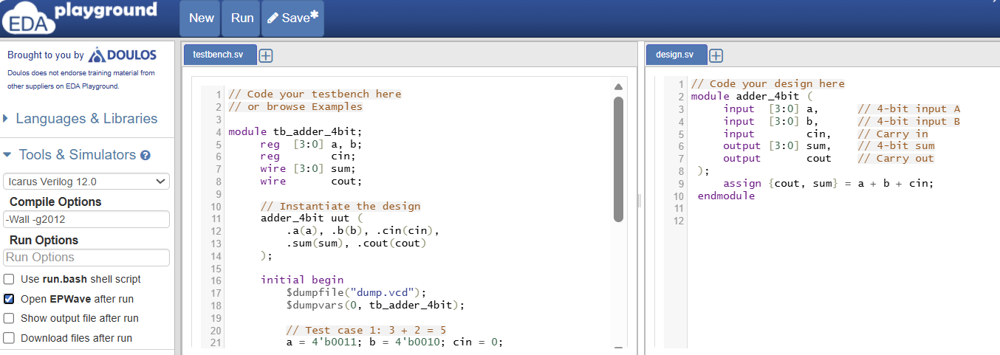
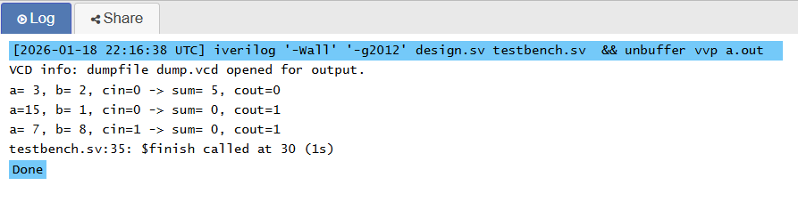
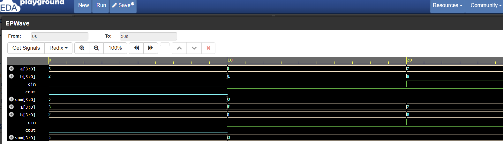

# Verilog Hello World: 4-bit Adder

A beginner-friendly introduction to Verilog HDL (Hardware Description Language) using a simple 4-bit adder circuit.

## Table of Contents
- [What is This Project?](#what-is-this-project)
- [What is Verilog?](#what-is-verilog)
- [Files in This Repository](#files-in-this-repository)
- [How to Run on EDA Playground](#how-to-run-on-eda-playground)
- [Understanding the Design Code](#understanding-the-design-code)
- [Understanding the Testbench](#understanding-the-testbench)
- [What to Watch For](#what-to-watch-for)
- [Common Beginner Questions](#common-beginner-questions)
- [Next Steps](#next-steps)

---

## What is This Project?

This project implements a **4-bit binary adder** - one of the fundamental building blocks of digital circuits. Every computer processor contains thousands of adders!

### What Does the Circuit Do?

```
    a[3:0]  ──┐
              ├──►  4-bit   ──►  sum[3:0]
    b[3:0]  ──┤     Adder
              │              ──►  cout (carry out)
    cin     ──┘
```

| Signal | Width | Description |
|--------|-------|-------------|
| `a` | 4 bits | First input number (0-15) |
| `b` | 4 bits | Second input number (0-15) |
| `cin` | 1 bit | Carry-in (for chaining adders) |
| `sum` | 4 bits | Result of addition (0-15) |
| `cout` | 1 bit | Carry-out (1 if overflow occurred) |

### Quick Example

Adding 3 + 2:
```
Input a   = 0011  (3 in decimal)
Input b   = 0010  (2 in decimal)
Input cin = 0

Output sum  = 0101  (5 in decimal)
Output cout = 0     (no overflow)
```

---

## What is Verilog?

Verilog is a **Hardware Description Language (HDL)** - it describes digital circuits using code. Unlike software programming languages (Python, C, Java) that describe steps a computer should execute, Verilog describes **physical hardware** that exists and operates in parallel.

**Key Differences from Software:**
| Software (C, Python) | Hardware (Verilog) |
|---------------------|-------------------|
| Executes line by line | Everything runs simultaneously |
| Variables hold data | Signals represent physical wires |
| Functions are called | Modules are instantiated (like placing chips on a board) |
| One operation at a time | Millions of operations in parallel |

---

## Files in This Repository

```
verilog-hello-world/
├── README.md                  # This file
├── src/
│   ├── adder_4bit.v          # The design (the actual circuit)
│   └── tb_adder_4bit.v       # The testbench (tests the circuit)
└── images/
    ├── edaplayground-code.png
    ├── edaplayground-console.png
    └── edaplayground-waveform.png
```

**Design vs Testbench:**
- **Design** (`adder_4bit.v`): The actual hardware you're creating. This can be synthesized into a real chip.
- **Testbench** (`tb_adder_4bit.v`): Test code that verifies your design works. This is simulation-only and cannot become real hardware.

---

## How to Run on EDA Playground

[EDA Playground](https://www.edaplayground.com) is a free, browser-based tool for simulating Verilog. No installation required!

### Step-by-Step Instructions

1. **Go to EDA Playground**
   - Visit [https://www.edaplayground.com](https://www.edaplayground.com)
   - Create a free account or log in

2. **Set Up the Simulator**
   - In the left sidebar under "Tools & Simulators"
   - Select **Icarus Verilog 12.0**

3. **Enter the Design Code**
   - In the **left editor** (design.sv), paste the contents of [`src/adder_4bit.v`](src/adder_4bit.v)

4. **Enter the Testbench**
   - In the **right editor** (testbench.sv), paste the contents of [`src/tb_adder_4bit.v`](src/tb_adder_4bit.v)

5. **Enable Waveform Viewing**
   - Check the box: ✅ **Open EPWave after run**

6. **Run!**
   - Click the **Run** button

### Screenshot: Code in EDA Playground



### Expected Console Output



You should see output like this:
```
========== STARTING TESTS ==========

Test 1: Simple Addition
  Inputs:  a = 3 (0011), b = 2 (0010), cin = 0
  Outputs: sum = 5 (0101), cout = 0
  Expected: 3 + 2 = 5, no overflow

Test 2: Overflow Detection
  Inputs:  a = 15 (1111), b = 1 (0001), cin = 0
  Outputs: sum = 0 (0000), cout = 1
  Expected: 15 + 1 = 16, but sum shows 0 with cout=1 (OVERFLOW!)
  Note: cout=1 means the true result is sum + 16 = 16

Test 3: Using Carry-In
  Inputs:  a = 7 (0111), b = 8 (1000), cin = 1
  Outputs: sum = 0 (0000), cout = 1
  Expected: 7 + 8 + 1 = 16 -> sum=0, cout=1

Test 4: Zero Addition
  Inputs:  a = 0 (0000), b = 0 (0000), cin = 0
  Outputs: sum = 0 (0000), cout = 0
  Expected: 0 + 0 = 0, no overflow

Test 5: Maximum Without Overflow
  Inputs:  a = 8 (1000), b = 7 (0111), cin = 0
  Outputs: sum = 15 (1111), cout = 0
  Expected: 8 + 7 = 15 (fits in 4 bits), no overflow

========== ALL TESTS COMPLETED ==========
```

### Waveform Viewer (EPWave)



The waveform shows how signals change over time. This is crucial for debugging hardware!

---

## Understanding the Design Code

Let's break down `adder_4bit.v` line by line:

### Module Declaration

```verilog
module adder_4bit (
    input  [3:0] a,
    input  [3:0] b,
    input        cin,
    output [3:0] sum,
    output       cout
);
```

**What's happening here:**

| Element | Meaning |
|---------|---------|
| `module adder_4bit` | Defines a hardware block named "adder_4bit" |
| `input` / `output` | Declares ports (connections to the outside world) |
| `[3:0]` | Bit width - this is a 4-bit signal (bits 3, 2, 1, 0) |
| No brackets | Single bit (1-bit wide) |

**Think of a module like a chip:** it has pins (ports) that connect to other chips or the outside world.

### The Magic Line

```verilog
assign {cout, sum} = a + b + cin;
```

This single line implements the entire adder! Let's decode it:

**1. `assign` - Continuous Assignment**
- Creates **combinational logic** (no clock needed)
- The output ALWAYS reflects the current inputs
- Like a mathematical equation that's constantly being evaluated

**2. `a + b + cin` - Addition**
- Verilog understands binary addition
- Two 4-bit numbers plus a 1-bit carry can produce up to 5 bits
- Maximum: 15 + 15 + 1 = 31 (binary: 11111)

**3. `{cout, sum}` - Concatenation**
- Curly braces `{}` join signals together
- `{cout, sum}` = `{1 bit, 4 bits}` = 5 bits total
- The 5-bit result is split: MSB goes to `cout`, lower 4 bits go to `sum`

**Visual Example:**
```
  a = 1111 (15)
+ b = 0001 (1)
+ cin = 0
-----------
= 10000 (16 in binary, needs 5 bits!)

Split into: cout = 1, sum = 0000
```

### Behavioral vs Structural Verilog

This design is **behavioral** - we describe WHAT we want (addition), not HOW to build it.

The alternative is **structural** Verilog, where you'd connect individual gates:
```verilog
// Structural (more complex, not shown in this example)
full_adder fa0 (.a(a[0]), .b(b[0]), .cin(cin), .sum(sum[0]), .cout(c1));
full_adder fa1 (.a(a[1]), .b(b[1]), .cin(c1), .sum(sum[1]), .cout(c2));
// ... and so on
```

For learning, behavioral is easier. For optimization, structural gives more control.

---

## Understanding the Testbench

The testbench (`tb_adder_4bit.v`) tests our design. Let's understand each part:

### Signal Declarations

```verilog
reg  [3:0] a, b;
reg        cin;
wire [3:0] sum;
wire       cout;
```

**`reg` vs `wire` - The Most Confusing Part for Beginners!**

| Type | When to Use | Analogy |
|------|-------------|---------|
| `reg` | Signals YOU drive from `initial` or `always` blocks | A variable you can write to |
| `wire` | Signals driven BY another module | A read-only connection |

**Simple rule:**
- Inputs to your design under test → `reg` (you control them)
- Outputs from your design under test → `wire` (the design controls them)

### Module Instantiation

```verilog
adder_4bit uut (
    .a(a),
    .b(b),
    .cin(cin),
    .sum(sum),
    .cout(cout)
);
```

This creates an **instance** of the adder and connects it to our test signals.

**Syntax breakdown:**
- `adder_4bit` - The module type (like a class in OOP)
- `uut` - Instance name ("Unit Under Test" - common convention)
- `.a(a)` - Connect module's port `a` to our signal `a`

The dot-name (`.a`) is the port on the module. The name in parentheses `(a)` is your signal.

### The Initial Block

```verilog
initial begin
    // Test code here
end
```

**Key points:**
- `initial` blocks run **once** at simulation start
- Code executes **sequentially** (like software)
- This is **simulation only** - real hardware has no "initial" concept

### Timing with `#`

```verilog
a = 4'b0011;
b = 4'b0010;
#10;  // Wait 10 time units
```

The `#10` is crucial! It tells the simulator to wait, giving the combinational logic time to "settle" before we check the outputs.

Without delays, all assignments would happen at time 0, and you couldn't observe changes.

### Display and Dump Commands

```verilog
$dumpfile("dump.vcd");     // Create waveform file
$dumpvars(0, tb_adder_4bit); // Record all signals
$display("Test: %d + %d = %d", a, b, sum);  // Print to console
$finish;  // End simulation
```

| Command | Purpose |
|---------|---------|
| `$dumpfile` | Names the waveform output file |
| `$dumpvars` | Specifies which signals to record |
| `$display` | Prints formatted text (like `printf` in C) |
| `$finish` | Stops the simulation |

---

## What to Watch For

### In the Console Output

1. **Verify each test case** - Does `sum` match your mental math?
2. **Check overflow cases** - When `cout = 1`, the true result is `sum + 16`
3. **Look for unexpected X or Z values** - These indicate uninitialized or floating signals

### In the Waveform Viewer (EPWave)

1. **Signal Timing**
   - Inputs (`a`, `b`, `cin`) change every 10 time units
   - Outputs (`sum`, `cout`) change **immediately** after inputs
   - No delay = combinational logic working correctly

2. **Binary vs Decimal**
   - Right-click signals to change display format
   - Try viewing `sum` in both binary and decimal

3. **The Carry-Out Signal**
   - Watch `cout` - it pulses HIGH during overflow tests
   - This is how CPUs detect arithmetic overflow

4. **Signal Hierarchy**
   - Expand `tb_adder_4bit` to see all signals
   - Expand `uut` to see the adder's internal signals

### Things to Try

1. **Add your own test case** - What happens with `a=10, b=10`?
2. **Change timing** - What if you use `#5` instead of `#10`?
3. **Break the design** - What happens if you change `+` to `-`?

---

## Common Beginner Questions

### Why `[3:0]` instead of `[0:3]`?

Both work, but `[3:0]` is convention. The first number is the MSB (Most Significant Bit). `a[3]` is the "big" bit, `a[0]` is the "small" bit.

### What's the difference between `=` and `<=`?

- `=` is **blocking assignment** (used in combinational logic and testbenches)
- `<=` is **non-blocking assignment** (used in sequential logic with clocks)

For this example, `=` is correct. You'll learn `<=` when you study flip-flops.

### Why do we need `$finish`?

Some simulators run forever without it. It's like `return 0` in C's `main()` - tells the program to stop.

### What is `4'b0011`?

It's a **sized literal**:
- `4` = 4 bits wide
- `'b` = binary format
- `0011` = the value (3 in decimal)

Other formats: `4'd3` (decimal), `4'h3` (hexadecimal)

---

## What is Overflow?

When adding two 4-bit numbers, the result might exceed 15 (the maximum 4-bit value). This is called **overflow**.

**Example: 15 + 1 = 16**
```
  1111  (15)
+ 0001  (1)
-------
 10000  (16 - needs 5 bits!)
```

Since `sum` is only 4 bits, we get:
- `sum = 0000` (the lower 4 bits)
- `cout = 1` (the overflow bit)

The carry-out tells us: "The real answer is `sum + 16`"

This is exactly how CPUs detect integer overflow!

---

## Next Steps

After mastering this example, try these projects in order:

1. **4:1 Multiplexer** - Learn conditional logic (`? :` operator)
2. **D Flip-Flop** - Introduction to sequential logic and clocks
3. **4-bit Counter** - Combine flip-flops to count clock cycles
4. **7-Segment Decoder** - Practical application to display digits
5. **Simple ALU** - Combine adder with other operations

---

## Resources

- [EDA Playground](https://www.edaplayground.com) - Free online simulator
- [ASIC World Verilog Tutorial](http://www.asic-world.com/verilog/veritut.html) - Comprehensive tutorial
- [HDLBits](https://hdlbits.01xz.net/) - Interactive Verilog exercises

---

## License

This project is released into the public domain. Use it freely for learning!
